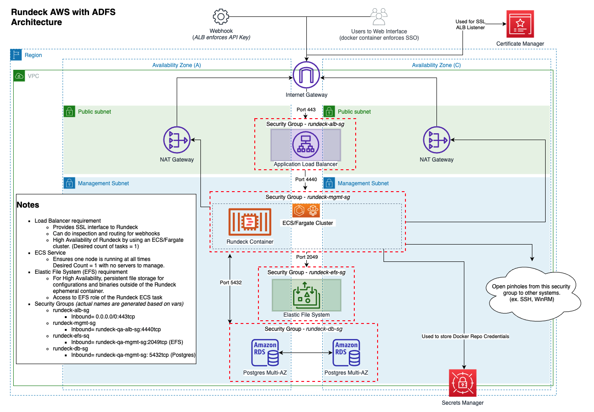

# Rundeck Community on AWS with SSO

## Overview
This solution used to create a [Rundeck Community](https://rundeck.org) environment on AWS that is protected by ADFS SSO.

&nbsp;
## Initial Use case
To have Rundeck Community running in a highly available architecture with SSO for ADFS.  And to have components preloaded for Windows Management.

&nbsp;

## Things to come
* [ ] To user Supervisor to control the threads
* [ ] Expand beyond ADFS for SSO
* [ ] To make SSO optional
* [ ] Add a API Proxy to mimic *Advanced Webhooks* offered by Rundeck Enterprise
* [ ] Ditch the fork of Vouch-Proxy and use OpenResty NGINX with a module to rewrite headers

&nbsp;
## Architecture
The architecture of the environment is meant to be portable and repeatable so environments can be strategically placed as needed.



### Architectural components
* **Application Load Balancer** - This acts as proxy to the rundeck container, providing SSL termination, API Key requirements for webhooks,and enforcing users use SSO through traffic filtration
* **Elastic Container Services/Fargate** - Provides a Highly Available serverless container hosting solution for the Rundeck Image.  The setup ensures that one container is always running in a healthy state (utilizing ELB health checks).  It is Availability Zone aware to provide tolerance, as it can spin up instances on different AZ's
* **Elastic File System (EFS)** - Provides a persistent/shared file system for the containers (logs, shared binaries, configurations)
* **Postgres RDS** - a Multi-AZ database backend for the application
* **Certificate Manager** - To provide SSL to the ALB listener
* **Secrets Manager** - Stores the docker repository credentials

## Docker
While Rundeck does provide an image for it's application, in order to achieve the SSO and Highly Availability requirements, we have to create our own.
### Basics of the Docker Image
* This is a multi stage docker file, because we have to compile an open source GO program for the SSO requirement.
* Use `golang:1.17.2` to build https://github.com/masoncashews/vouch-proxy-rundeck 
  * This is a fork of https://github.com/vouch to allow for customer qualifiers of claims values.  *Vouch qualifies all claims with " which Rundeck doesn't like.*
* From there it copies the compiled application to an image that starts with a base of `rundeck/rundeck:3.4.3`
* It installs components required for Rundeck and SSO including:
  * nginx
  * python
  * pywinrm
* Since the Rundeck image already uses an `entrypoint.sh` and [remco](https://github.com/HeavyHorst/remco), we just tap into that by adding/overwriting files as necessary.
* The result is a container that runs
  * rundeck as a java war executable
  * nginx as a reverse proxy in front of rundeck
  * vouch-proxy to act as the SSO mediator for nginx
    * This is the process that "holds" the docker image open.


### Environment Variables at play
All of the [standard Rundeck environment variables](https://docs.rundeck.com/docs/administration/configuration/docker.html#environment-variables) are available

New environment variables
* `SSO_LOG_LEVEL`: The vouch proxy log level, defaults to Info
  * Info, Warn, Debug are viable values
* `SSO_PROTECTED_DOMAIN`: The domain name of the rundeck node.  Would be the domain bound to the AWS Load Balancer
  * ex. qa.rundeck.encoretesting.com
* `SSO_PROTECTED_DOMAIN_SCHEME`: The scheme of the protected domain... http or https.
  * Defaults to https
* `SSO_CLIENT_ID`: The guid client id for the application group in ADFS oAuth.
* `SSO_CLIENT_SECRET`: The guid client secret for the application in ADFS oAuth.
  * **NOTE:** This only available during creation of the Application Group in ADFS, or you'll have to generate a new one.
* `SSO_AUTH_URL`: The oAuth authorize url for ADFS.
  * ex. https://<adfs domain>/adfs/oauth2/authorize/
* `SSO_TOKEN_URL`: The oAuth token url for ADFS.
  * ex. https://<adfs domain>/adfs/oauth2/token/
* `SSO_LOGOUT_URL`: The oAuth logout url for ADFS.
  * ex. https://<adfs domain>/adfs/oauth2/logout
* `SSO_RELYING_PARTY_ID`: The relying party id from ADFS.  Can be anything but is usually the protected domain.
* `SHARED_FILES_PATH`: This is used to put all the logs and shareable rundeck files in a central location.  Important for a HA environment.
  * EFS mount should be the target.
* `VOUCH_DELAY`: This is how long to delay Vouch from starting,  in seconds.  This should be a long enough for Rundeck to finish starting (usually about a minute) and so the startup script can sync libraries to the shared location before starting Vouch-Proxy.
  * Defaults to 10 seconds.

#### Typical Environment Setup for the container
Assumptions
* Rundeck node domain: rundeck.example.com
* ADFS oAuth domain: adfs.example.com

```
RUNDECK_SERVER_FORWARDED=true
RUNDECK_GRAILS_URL=https://rundeck.example.com
RUNDECK_DATABASE_DRIVER=org.postgresql.Driver
RUNDECK_DATABASE_URL=jdbc:postgresql://<endpoint and dbname>
RUNDECK_DATABASE_USERNAME=<string>
RUNDECK_DATABASE_PASSWORD=<string>
RUNDECK_STORAGE_CONVERTER_1_CONFIG_PASSWORD=<string>
RUNDECK_CONFIG_STORAGE_CONVERTER_1_CONFIG_PASSWORD=<string, the same as RUNDECK_STORAGE_CONVERTER_1_CONFIG_PASSWORD>
RUNDECK_PREAUTH_ENABLED=true
RUNDECK_PREAUTH_USERSYNC_ENABLED=true
RUNDECK_PREAUTH_USERSYNC_EMAIL=X-USER
RUNDECK_PREAUTH_DELIMITER=;
RUNDECK_PREAUTH_USERNAME_HEADER=X-USER
RUNDECK_PREAUTH_ROLES_HEADER=X-USER-GROUP
RUNDECK_LOGGING_STRATEGY=FILE
RUNDECK_PREAUTH_REDIRECT_LOGOUT=true
RUNDECK_PREAUTH_REDIRECT_URL=/rundecklogout #This is an nginx location I put in to make sure we nuke the JSESSION from rundeck then forward to the ADFS logout
SSO_PROTECTED_DOMAIN=rundeck.example.com
SSO_CLIENT_SECRET=<string/guid provided during ADFS App creation>
SSO_CLIENT_ID=<string/guid client id from ADFS>
SSO_LOGOUT_URL=https://adfs.example.com/logout
SSO_AUTH_URL=https://adfs.example.com/authorize/
SSO_TOKEN_URL=https://adfs.example.com/token/
SSO_RELYING_PARTY_ID=<string... set in ADFS>
VOUCH_DELAY=65
SHARED_FILES_PATH=/sharedfiles #the mountpoint of the EFS volume.  Very important to not have a trailing /
```
### Build out process
#### When you make changes to the `DockerFile` or it's assets do these things
* Update the DockerFile version label
  * `LABEL version="1.1"` ... *something meaningful*
  * Add an entry to the `changelog.md` file
  * Build and publish to the repo (change tag as appropriate to match version)
    ```
    cd docker
    
    docker build -t rundeck-aws:1.0 .  
    ```

## Terraform
After you've built your container and have it in a repository, you can build the environment using terraform.
* [rundeck.ecs.tf](terraform/rundeck.ecs.tf) is a parameterized terraform that will build out the architecture with Infrastructure as Code (IaC)

### Prerequisites
* A domain name that will resolve to the rundeck node
  * You'll need to be able to update the DNS record after the architecture is built.
* An SSL certificate for that domain provisioned through Amazon Certificate Manager (ACM)
  * This is a free certificate, but can only be bound to certain AWS services, including the Application Load Balancer
* An AWS environment that already has public/private subnets, internet gateways, nat gateways, etc.
* An AWS access token and key to the chosen AWS account.

&nbsp;
### Parameters/Variables
While the variables are annotated with comments in the file, theres an [example tfvars file](terraform/example.auto.tfvars)

&nbsp;
### Basic instructions
After you have the following you'll be able to build the environment
* An AWS environment with public and private subnets, gateways, etc.
* AWS Credentials to that environment
* A Domain name and a way to edit the DNS record
* An AWS Certificate Manager certificate for that domain name
* The docker image pushed to a repository
* Terraform installed
* A tfvars file fully filled out

#### Build out process
```
terraform init
terraform plan
terraform apply
```
After it's done you'll need to setup your DNS record to point to the Application Load Balancer DNS name (usually an alias in Route53 or CNAME in standard DNS)

&nbsp;
## Links of interest
* [Rundeck Community](https://www.rundeck.com/open-source)
  * [Rundeck Docker Containers](https://hub.docker.com/r/rundeck/rundeck)
  * [REMCO](https://heavyhorst.github.io/remco/details/) - the configuration manager used by Rundeck's containers.
  * [PyWinRM](https://github.com/diyan/pywinrm) - Python Windows Remote Management library used by Rundeck
* [Hashicorp Terraform](https://www.terraform.io/)
* [Vouch Proxy](https://github.com/vouch/vouch-proxy) - The SSO Proxy used.
  * [Vouch Proxy Custom Fork](https://github.com/masoncashews/vouch-proxy-rundeck) - My fork that deals with Rundeck's weird treatment of " qualifiers on header values.